 图标作为网页设计中的一部分，其在凸显网页重要元素特性，视觉交互、引导以及网页装饰等充当的角色作用举足轻重。由于图标普遍具有尺寸小的特点，在项目实践时不宜将每个图标作为单个图片元素进行加载，这会大大增加Http请求，影响网页的性能。因此，在实际中，我们可能见到以下一些常见的解决方案：

 + 将多个图标按照一定排列顺序合并在一个图片里（即`sprite图`），再通过CSS设置元素的`background-position`来为元素设置背景从而展示图标
 + 将单个图标元素转成`base64`格式，并在CSS声明背景
 + 使用`SVG`或者图标字体库来绘制图标
 + 使用CSS来绘制图标
 + ...
 
以上方式都可以很好的实现功能，各有各的优缺点。在移动端，我个人比较偏好使用CSS来实现一些图标，原因有以下几点：

+ 适应性和定制性强，如可以随意改变颜色，大小
+ 占用空间小
+ 在移动端兼容性高
+ 可以不断使自己熟悉CSS3的各个属性并得以应用


而由于CSS3的普及和在各大浏览器的不断增强支持，使CSS具有更大的可能性和能力去绘制更多样化，更复杂的图标。当然，也有不少人反对网站图标使用CSS绘制的，在这里不加以讨论。

本文将单独讲解如何用CSS绘制一些图标。而由于用CSS实现图标绘制，偶尔意味着你需要用更复杂的html结构去支持图标的绘制，所以本文讲解的将是`单标签CSS图标`。这样可以实现类似仅用`img`标签或者单个标签应用字体库实现图标绘制的效果。讲解如何绘制之前，先给大家看看前阵子得闲绘制的若干个单标签CSS图标。

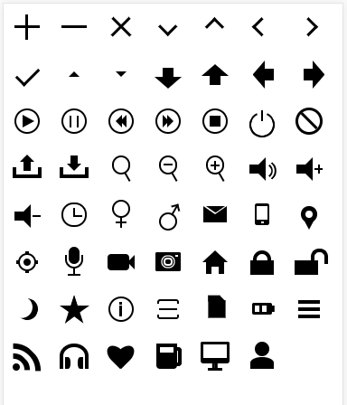

### 你需要掌握的CSS属性

绘制图标，单从绘制来讲，无非就是画点、线、面。然后将多个点线面组合得到图标。因此，你至少应该掌握以下CSS属性的应用

+ 盒子模型
+ border属性的应用（很重要，可以参考）
+ position的各个属性值的应用
+ transform变形
+ `outline`,`box-shadow`（常见于多边框绘制）
+ CSS渐变(常用于图标中透明过渡)
+ 伪类和伪元素的应用
+ `transition`，`animation`（如果要绘制动态图标，本文仅讲解静态图标）

需要掌握的主要为以上内容，有些特殊的处理可能还需要其他一些CSS属性的应用。

### 几个说明

+ 由于大部分情况下图标的大小按照所处环境上下文的字体大小来决定，所以本文所有例子的大小单位大部分使用`em`，按照当前字号来设定大小
+ 有些`border`属性没有指明`border-color`,如`border-top: .4em solid`,是因为`border-color`默认继承了字体颜色
+ 所有图标仅作为例子展示，实现方法多样，不代表最佳实践

### 基本元素的绘制

#### 用`border`属性绘制元素

border除了作为简单的绘制边框以外，还可以绘制三角形，梯形，星形等任意的多边形，以下为绘制的两个三角形和梯形，更多的应用可以参考
[border属性的多方位应用和实现自适应三角形](https://juejin.im/post/5a162d3ff265da43062a6e27)这篇文章，里面全面的介绍了用border绘制各种多边形。
```html
<div class="triangle1"></div>
<div class="triangle2"></div>
<div class="trapezoid"></div>
```

```css
.triangle1 {/*锐角三角形*/
	width: 0;
	height: 0;
	border-top:50px solid transparent;
	border-bottom:100px solid #249ff1;
	border-left: 30px solid transparent;
	border-right: 100px solid transparent;
}
.triangle2 {/*直角三角形*/
	width: 0;
	height: 0;
	border-top: 80px solid transparent;
	border-bottom: 80px solid #ff5b01;
	border-left: 50px solid #ff5b01;
	border-right:50px solid transparent;
	}
.trapezoid {/*梯形*/
	width:0;
	height:0;
	border-top:none;
	border-right:80px solid transparent;
	border-bottom:60px solid #13dbed;
	border-left: 80px solid #13dbed;
}

```
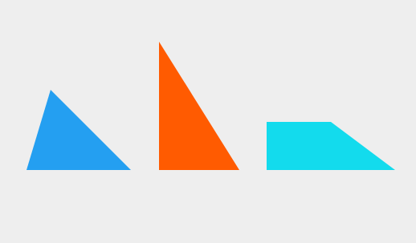


#### 用`border-radius`绘制元素

`border-radius`主要用于绘制圆点、圆形、椭圆、圆角矩形等形状，以下为简单绘制的两个图形。

```html

<div class="circle"></div>
<div class="ellipse"><div>

```

```css
.circle,.ellipse {
	width: 100px;
	height: 100px;
	background: #249ff1;
	border-radius: 50%;
}
.ellipse {
	width: 150px;
	background: #ff9e01;
}
```
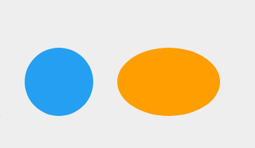

但`border-radius`属性实际上可以设置最多8个值，通过改变8个值可以得到许多意想不到的图像，如图（该图来源于[这里](http://www.zhangxinxu.com/wordpress/2015/11/css3-border-radius-tips/)）

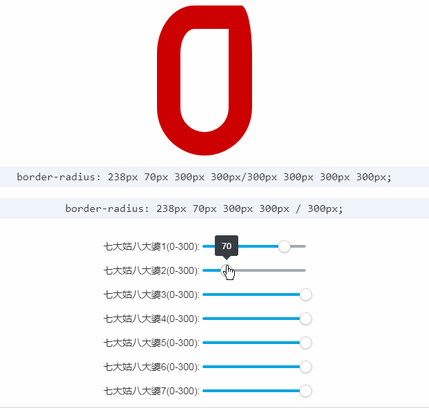 
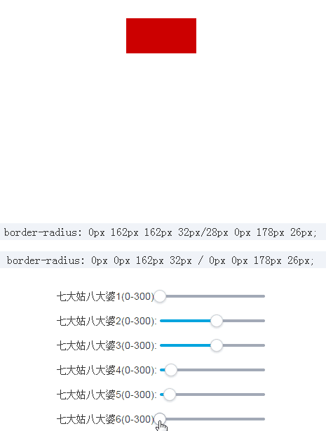

更多关于`border-radius`属性的特点和应用请参考张鑫旭写的[《秋月何时了，CSS3 border-radius知多少？》](http://www.zhangxinxu.com/wordpress/2015/11/css3-border-radius-tips/)

#### 用`box-shadow`绘制元素

对于`box-shadow`，其完整的声明为`box-shadow: h-shadow v-shadow blur spread color inset`,各个值表示的意义分别为：s水平方向的偏移，垂直方向的便宜，模糊的距离（羽化值），阴影的大小（不设置或为0时阴影与主体的大小一致），阴影的颜色和是否使用内阴影。实际应用时可以接收3-6个值，对应分别如下：

+ 3个值： h-shadow v-shadow color
+ 4个值： h-shadow v-shadow blur color
+ 5个值： h-shadow v-shadow blur spread color
+ 6个值： h-shadow v-shadow blur spread color inset

同时，`border-shadow`接受由多个以上各种值组成的以逗号分隔的值，通过这一特性，我们可以实现如多重边框的等效果。以下我们用该属性来实现一个单标签且不借助伪元素的**添加图标**和**代表目标的的图标**。（为方便观察，这里将添加符号的实现部分用红色代替）

```html
<div class="plus"></div>
<div class="target"></div>
```

```css
.plus {
	width: 30px;
	height: 30px;
	margin-left: 50px;/*由于box-shadow不占空间，常常需要添加margin来校正位置*/
	background: #000;
	box-shadow: 0 -30px 0 red, 0 30px 0 red, -30px 0 0 red, 30px 0 0 red;
}
.target {
	width: 30px;
	height: 30px;
	background: red;
	border-radius: 50%;
	margin-left: 50px;
	box-shadow: 0 0 0 10px #fff, 0 0 0 20px red, 0 0 0 30px #fff, 0 0 0 40px red;
}
```

结果如下：

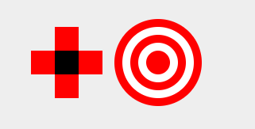

以上，添加符号采用多个由四个值组成的以逗号分隔的值来设置加号的四个角达到效果，目标图标则通过多次设置阴影大小大于主体大小的值叠加成了多个圆环来实现。

> 由于`box-shadow`不占据空间，实际应用中常常需要设置`margin`来矫正图标的位置，这和`outline`属性一致，两个属性最大的不同是outline形成的区域不会因为`border-radius`而形成圆角。

#### 使用CSS渐变来绘制图标

CSS3的渐变属性十分强大，理论上通过渐变可以绘制出任何的图形，渐变的特性和使用足足可以写一篇长文，以下为一个例子
```html
<div class="gradient"></div>
```

```css
.gradient {
	position: relative;
	width: 300px;
	height: 300px;
	border-radius: 50%;
background-color: silver;
	background-image: linear-gradient(335deg, #b00 23px, transparent 23px),
	                  linear-gradient(155deg, #d00 23px, transparent 23px),
	                  linear-gradient(335deg, #b00 23px, transparent 23px),
	                  linear-gradient(155deg, #d00 23px, transparent 23px);
	background-size: 58px 58px;
	background-position: 0px 2px, 4px 35px, 29px 31px, 34px 6px;
}
```

以上将得到如下结果

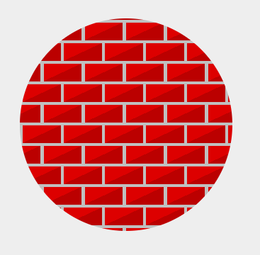

关于线性渐变属性的用法，可以参考[这里](https://developer.mozilla.org/en-US/docs/Web/CSS/linear-gradient)

更多牛逼的例子可以观摩[这里](http://lea.verou.me/css3patterns/)


### 小试牛刀

有了以上的基础之后，我们就可以一步步打造一个属于自己的单标签CSS图标库。文章最前面提到了下面这些图标


现在抽取其中几个尝试绘制实现一下。

+ 杯子
	
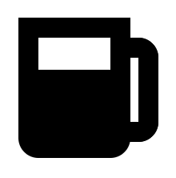

首先我们对杯子进行拆分，很容易想到将杯子拆分为杯身和杯柄两个部分。拆分之后，应该用两个圆角矩形来实现，至于杯子的轮廓（图中黑色部分），我们可以选择用边框`border`来实现，`border`的颜色按实际填充即可（本文未指定时默认为跟随当前字体的颜色）。由于是单标签实现，因此，我们还要借助一个伪元素(杯柄)来实现这个图标。于是就有了以下的样式：

```css
.cup {
	display: inline-block;
    width: .9em;
    height: .4em;
    border: .25em solid;
    border-bottom: 1.1em solid;
    border-radius: 0 0 .25em .25em;
}
cup:before {
    position: absolute;
    right: -.6em;
    top: 0;
    width: .3em;
    height: .8em;
    border: .25em solid;
    border-left: none;
    border-radius: 0 .25em .25em 0;
    content: '';
}
```

以上便实现了一个杯子的图标，通过调整边框颜色（默认为与当前字体颜色相同）和宽度即可实现不同大小的图标。

+ 心形

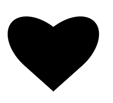

仔细观察这个心形，它实际上应该可以近似看做是由以下两个形状按照一定的角度旋转和平移组成。

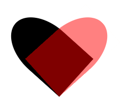

因此我们可以用两个元素来绘制这两个部分，通过设置背景色和`border-radius`，然后按照一定的角度旋转并平移则可得到。为了方便定位，这里我们用两个伪元素来绘制这两个部分。为了方便观察，我们先设置如下样式

```css
.heart{
	display: inline-block;
	margin-top: 1.5em;
	width:50px;
	height: 50px;
	background: green;
}
.heart:before,.heart:after {
  position: absolute;
  width: 1em;
  height: 1.6em;
  background: #000;
  border-radius: 50% 50% 0 0;
  content: '';
  bottom: 0;
}
.heart:before {
  -webkit-transform: rotate(45deg);
  -webkit-transform-origin: 100% 100%;
  right: 0;
  background: red;
  opacity: .5;
  z-index: 5;
}
.:after {
  -webkit-transform: rotate(-45deg);
  -webkit-transform-origin: 0 100%;
  left: 0;
  opacity: .8;
}
```

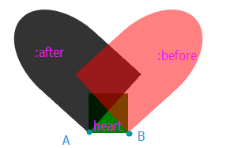

可以看到，此时两个元素将因为`.heart`元素的宽度而撑开了一段距离，如果我们把`.heart`的宽高都设为0，则得到如下结果：

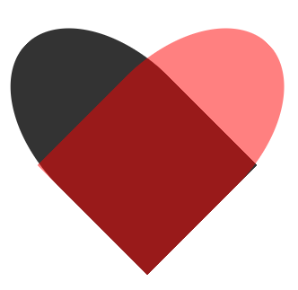

到这里为止，已经完成了一个心形的绘制，但是仔细看，左右两侧会有一个边角突出，这是因为旋转的角度不够导致。可以通过调大角度或者设置一个较大的圆角（适应性更高）来修复此问题。这里将旋转的角度调整为`48deg`。修改颜色和透明度后即得到如下结果：


+ 相机

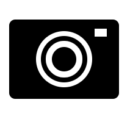

至于这个相机，由于前面已经介绍了如何用`border-radius`绘制一个代表目标的图标，问题就变得很简单了。整个相机分为三个部分，通过定位即可实现。以下直接贴实现代码。

```css
.camera {
	display: inline-block;
	border-style: solid;
	border-width: .65em .9em;
	border-radius: .1em;
}
.camera:before {
	position: absolute;
	top: -.3em;
	left: -.3em;
	width: .4em;
	height: .4em;
	border-radius: 50%;
	border: .1em solid #FFF;
	box-shadow: 0 0 0 .08em,0 0 0 .16em #fff;
	content: '';
}
.camera:after {
	position: absolute;
	top: -.5em;
	left: .5em;
	width: .2em;
	border-top: .125em solid #FFF;
	content: '';
}

```

+ 月亮

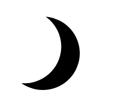

月亮这个图标看起来似乎挺难实现，但如果掌握了`border-radius`属性的应用，其实是相当的容易，以下为完整的CSS样式：

```css
.moon {
	display:inline-block;
	height: 1.5em;
	width: 1.5em;
	box-shadow: inset -.4em 0 0;
	border-radius: 2em;
	transform: rotate(20deg);
}
```
其核心是将阴影的模式设置为`inset`通过调整参数，可以得到不同的月亮形状，如下图：

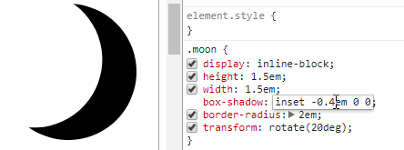


### 总结

用CSS绘制图标其实其核心就是将拆分后的多个元素经过旋转和平移得到。归根结底还是要掌握CSS相关属性的应用。一般由以下几个步骤：

+ 分析图标，拆分为小元素
+ 绘制小元素
+ 定位（平移和旋转等）
+ 设置在父级元素的定位（如用margin定位）

如果不限制于单个标签实现，那么可以绘制更多复杂的图标。以下为个人在绘制图标时的一点小体会：

+ 图标的颜色可以使用`border`属性去绘制
+ `border-color`大部分情况下可以不设置，默认跟随图标当前所在文本的字体颜色
+ 图标的大小单位可以使用`em`，即相对于当前所在文本的字体大小进行计算，这应该符合与大部分场合，适应性也高，复用性强。（以上例子中均仅需要调整父级的字体大小即可以放大或缩小图标）

以上所有图标的例子可以[点击这里下载看源码](https://github.com/prianyu/cssIcon/archive/master.zip)

或者访问[github查看](https://github.com/prianyu/cssIcon),如果觉得有帮助记得给个star。


### 相关阅读

[CSS魔法之重拾CSS乐趣（上）](https://github.com/cssmagic/blog/issues/52)

[CSS魔法之重拾CSS乐趣（下）](https://github.com/cssmagic/blog/issues/54)

[CSS3 Patterns Gallery](http://lea.verou.me/css3patterns/)

